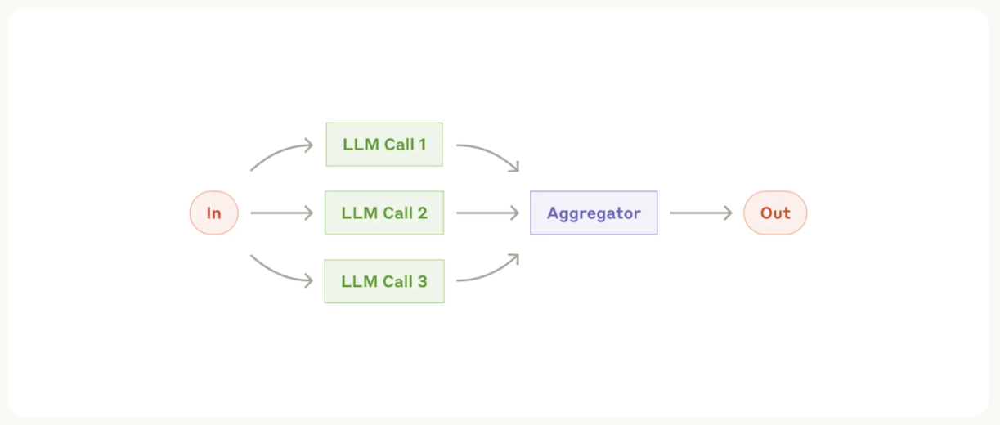

# AakashGyan: AI Agents for Bharat's Development

[](https://www.ibm.com)
[](https://www.ibm.com)

A suite of Agentic AI workflows built using IBM's ADK and Granite models to autonomously tackle real-world challenges in agriculture, healthcare, and public services in India.


## 🌟 Overview

AakashGyan (Sky Knowledge) is an innovative multi-agent AI system designed specifically for Indian agricultural challenges. This project implements IBM's Agent Development Kit (ADK) and Granite series models to create specialized AI agents that work in parallel to provide comprehensive farming solutions through an interactive interface.

## 🚀 Features

- **KrishiSahayak**: AI agent for crop disease diagnosis and treatment advice via SMS in regional languages
- **ArogyaMitra**: Healthcare triage agent for preliminary diagnosis and medical guidance
- **VidyutSarthi**: Government scheme navigation agent for subsidies and compliance
- **Multi-lingual Support**: Hindi, English, and regional language support
- **Real-time Data Integration**: Weather, market prices, and government scheme updates
- **SMS/WhatsApp Interface**: Accessible to farmers with basic mobile phones

## 🏗️ Architecture

The system consists of five specialized agents powered by IBM's technology stack:

1. **Info Gathering Agent**: Collects farmer details, location, and problem description
2. **Sustainability Agent**: Recommends sustainable farming practices and environmental impact reduction
3. **Farm Advisor Agent**: Suggests data-driven farming practices based on local conditions
4. **Market Intelligence Agent**: Provides real-time market prices and demand forecasts
5. **Final Planner Agent**: Aggregates all recommendations into actionable farming plans

These agents are orchestrated through IBM ADK workflows enabling parallel execution and dynamic routing.

## 🔧 Technical Stack

- **IBM Agent Development Kit (ADK)**: Core agent orchestration framework
- **IBM Granite Models**: Granite-13B-Code for logic and Granite-8B-Language for regional language processing
- **Python 3.11+**: Backend implementation
- **Streamlit**: Interactive web interface
- **ChromaDB**: Vector database for agricultural knowledge base
- **Twilio API**: SMS integration for rural accessibility

## 📋 Installation

### Prerequisites

- Python 3.11 or higher
- IBM Cloud account (for Granite model access)
- Twilio account (for SMS functionality)


## Features

- **Interactive Streamlit UI** with real-time streaming responses
- **Multi-agent architecture** with specialized agents for different aspects of planning
- **Parallel processing** of recommendations for improved efficiency
- **User preference management** for sustainability, farming advisory, and market intelligence
- **Conversational interface** for gathering details
- **Comprehensive plans** with sustainability, farming advisory, and market intelligence


### Running the Application

1. Start the Streamlit UI:
   ```bash
   streamlit run streamlit_ui.py
   ```

2. Open your browser and navigate to the URL displayed in the terminal (typically http://localhost:8501)

## Usage

1. **Set Your Preferences**: Use the sidebar to upload all the dataset files.

2. **Start a Conversation**: Type your request in the chat input. For example:
   ```
   I want a data driven solution for sustainable farming. Please provide a curated plan according to the data provided.
   ```

3. **Interact with the Agent**: The system will ask follow-up questions if any details are missing.

4. **Review Your Plan**: Once all details are collected, the system will generate a comprehensive plan with data driven recommendations.

Note that with this demonstration, once the final plan is given to you, the conversation is over. This can of course be extended to allow for editing the trip, asking more questions, etc.

## Project Structure

```

├── agents/                                        # Individual agent definitions
│   ├── sustainability_optimizer_agent.py          # Agent for recommending sustainable farming practices
│   ├── final_planner_agent.py                     # Agent for creating the final travel plan
│   ├── market_intelligence_agent.py               # Agent for market intelligence recommendations
│   ├── farmer_advisor_agent.py                    # Agent for best farming practices recommendations
│   └── info_gathering_agent.py                    # Agent for collecting details
├── agent_graph.py                                 # LangGraph workflow definition
├── streamlit_ui.py                                # Streamlit user interface
├── utils.py                                       # Utility functions
├── requirements.txt                               # Project dependencies
└── README.md                                      # Project documentation
```

## How It Works

1. The system starts by gathering all necessary information from the user through the Info Gathering Agent.
2. Once all required details are collected, the system simultaneously calls the all three agents to get recommendations.
3. Each specialized agent uses its tools to search for and recommend options based on the user's preferences.
4. After all recommendations are collected, the Final Planner Agent creates a comprehensive plan.
5. The entire process is streamed in real-time to the user through the Streamlit UI.

## Inspired by Anthropic's Agent Architecture

This project is a demonstration of the parallelization workflow showcased in [Anthropic's Agent Architecture blog](https://www.anthropic.com/engineering/building-effective-agents). The implementation follows a similar pattern where multiple specialized agents work in parallel to solve different aspects of a complex task.



The key architectural pattern demonstrated here is the ability to:
1. Gather initial information
2. Fan out to multiple specialized agents working in parallel
3. Aggregate results into a final, comprehensive response

This approach significantly improves efficiency compared to sequential processing, especially for complex tasks with independent subtasks.

## Customization

You can customize the system by:

- Modifying agent prompts in the respective agent files
- Adding new specialized agents for additional travel aspects
- Enhancing the tools with real API integrations for all agents
- Extending the user preference system with additional options


## Acknowledgments

- Built with [Pydantic AI](https://github.com/pydantic/pydantic-ai)
- Powered by [LangGraph](https://github.com/langchain-ai/langgraph)
- UI created with [Streamlit](https://streamlit.io/)
